# Wide Area Network

## <a name='DaftarIsi'></a>Daftar Isi

- [Daftar isi](#DaftarIsi)
- [Persiapan](#Persiapan)
- [Langkah-langkah](#LangkahLangkah)

  - [Setting WLAN pada MikroTik](#SettingWLANpadaMikroTik)
  - [Setting DHCP Server pada MikroTik](#SettingDHCPServerpadaMikroTik)
  - [Setting Komputer Client](#SettingKomputerClient)
  - [Testing](#Testing)

- [Masalah](#Masalah)

  - [WLAN **managed by CAPsMAN**](#WLANmanagedbyCAPsMAN)
  - [Interface is slave](#InterfaceisSlave)
  - [Hard Reset](#HardReset)

## <a name='Persiapan'></a>Persiapan

Perangkat:

1. Router MikroTik RB951Ui-2nd
2. Kabel UTP
3. WinBox

Persiapan:

1. Pastikan seluruh perangkat sudah siap.
2. Lakukan **Hard Reset** pada perangkat MikroTik dengan cara [ini](#HardReset).
3. Pastikan aplikasi **WinBox** sudah terinstall di komputer.

## <a name='LangkahLangkah'></a>Langkah-Langkah

### <a name='SettingWLANpadaMikroTik'></a>A. Setting WLAN pada MikroTik

**WLAN (Wireless Local Area Network)** adalah jaringan komputer lokal yang menggunakan gelombang radio (wireless) sebagai media transmisinya, misalnya menghubungkan antar perangkat seperti antar komputer atau menghubungkan router ke internet.

Setting WLAN pada router MikroTik bertujuan untuk memberikan akses internet pada router MikroTik. Berikut ini merupakan langkah-langkah yang dilakukan:

1.  Merakit jaringan komputer.

    <p align="center">
      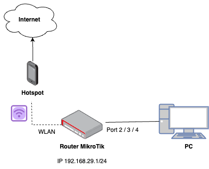
    </p>

    - Hubungkan kabel UTP dari komputer Anda ke port 2 pada router MikroTik.
    - Jika lampu indikator port 2 pada MikroTik tidak menyala, cabut kabel LAN dan pasang kembali ke salah satu port yang tersedia, misalnya port 2, 3, atau 4, hingga lampu indikator menyala.

2.  Melakukan koneksi dengan MikroTik.

    - Buka aplikasi WinBox
    - Buka tab **Neighbors**, klik tombol **Refresh**.
    - Tunggu hingga perangkat MikroTik terdeteksi dalam daftar.
    - Pilih baris pertama, dan klik pada kolom **Mac Address**.
    - Dalam keadaan default, masukkan `login: admin` dan biarkan `password kosong`, lalu klik tombol **"Connect"**.

      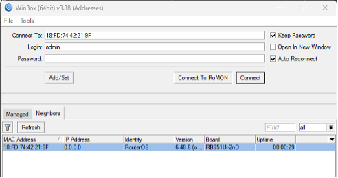

3.  Setting password mobile hotspot.

    - Buka menu **Wireless** dan pilih tab **Security Profiles**.

      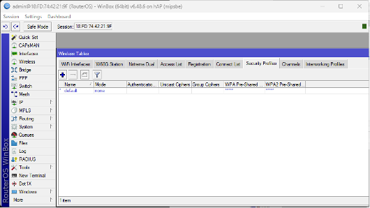

    - Klik tombol **plus** untuk menambahkan security profiles baru.
    - Isikan **Name** sesuai dengan keinginan, misalnya `password-hotspot`.
    - Pilih **Mode**: `dynamic keys`.
    - Centang semua **Authentication Types**.
    - Masukkan password hotspot Anda di **WPA Pre-Shared Key** dan **WPA2 Pre-Shared Key**.

      ```
      Contoh

      Name: pass_hotspot
      Password: 12345678
      ```

      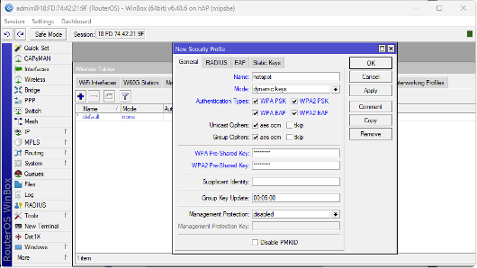

4.  Setting WLAN interface.

    - Masih di menu **Wireless** dan pilih tab **WiFi Interfaces**. Jika ada **managed by CAPsMAN**, lihat penyelesaiannya di [sini](#WLANmanagedbyCAPsMAN).

      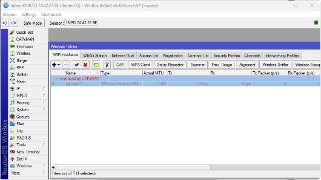

    - Klik tombol **plus** untuk menambahkan interface WLAN.
    - Pilih **Band** `2GHz-B/G/N` dan **Security Profile** sesuai dengan Security Profile yang telah dibuat sebelumnya, misalnya `password-hotspot`.

      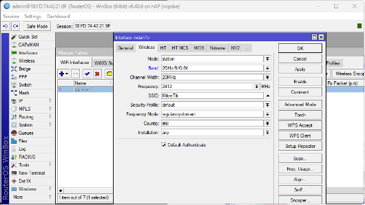

    - Klik tombol **Scan**.
    - Pada window **Scanner**, klik tombol **Start**. Kemudian pilih nama hotspot Anda, misalnya: `iPhone(2)`. Klik tombol **Connect**.

      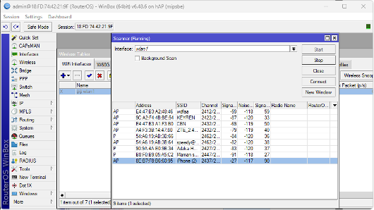

    - Hotspot berhasil terpilih. Terlihat pada kolom SSID berubah sesuai dengan ama hotspot Anda.

      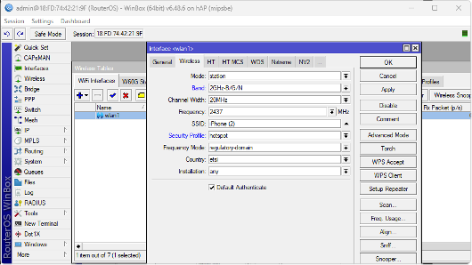

    - Setiap kali memilih hotspot baru, **harus melakukan start scanning** lagi dengan klik tombol **Scan** dan klik ulang tombol **Start**.
    - Jika sudah semua, klik tombol **Apply** dan **OK**.
    - Interface WLAN telah aktif.

      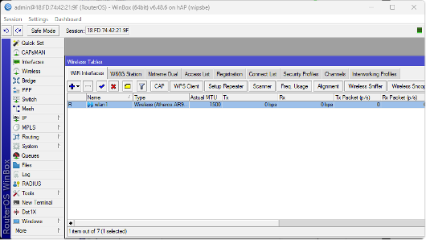

5.  Setting DHCP Client.

    - Buka menu **IP** dan pilih sub-menu **DHCP Client**.
    - Klik tombol **plus** untuk menambahkan DHCP Client.
    - Pilih **interface**: `wlan1` atau `wlan**`.

      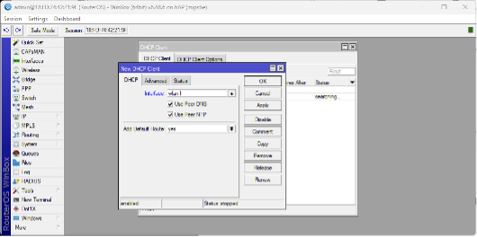

    - Klik tombol **Apply** dan **OK**.
    - Tunggu hingga wlan1 berstatus **bound**. Jika sudah berhasil bound, maka perangkat router MikroTik telah mendapatkan IP untuk mengakses ke internet.

      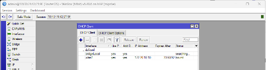

6.  Tes koneksi internet pada MikroTik.

    - Buka **New Terminal**.
    - Ketik `ping google.com`.

      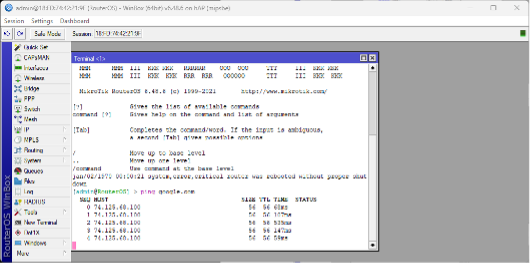

### <a name='SettingDHCPServerpadaMikroTik'></a>2. Setting DHCP Server pada MikroTik

1. Setting IP Address.

   - Buka menu **IP** dan pilih sub-menu **Addresses**.
   - Klik tombol **plus** untuk menambahkan IP Address pada port 2 (yang terhubung ke komputer).
   - Masukkan IP **192.168.10.1/24**.
   - Pilih **interfaces** sesuai dengan port yang digunakan, misalnya `ether2`.
   - Klik **Apply** dan **OK**.

     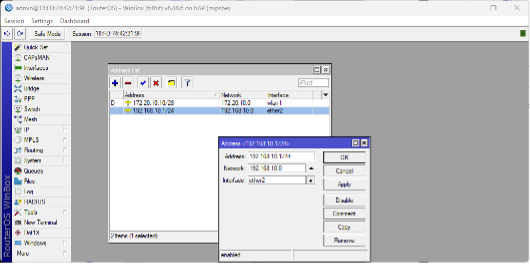

2. Setting Firewall NAT.

   - Buka menu **IP** dan pilih sub-menu **Firewall**. Klik tab **NAT**.
   - Klik tombol **plus** untuk menambahkan NAT rule.
   - Pada window **New NAT Rule**, pilih tab **Action**.
   - Pilih **Action**: `masquerade`.

     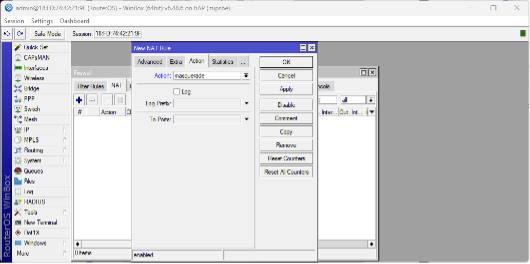

   - Klik **Apply** dan **OK**.

3. Setting DHCP Server.

   - Buka menu **IP** dan pilih sub-menu **DHCP Server**.
   - Klik tombol **DHCP Setup** untuk menambahkan DHCP Server.
   - Pilih **DHCP Server Interface**: `ether2`.

     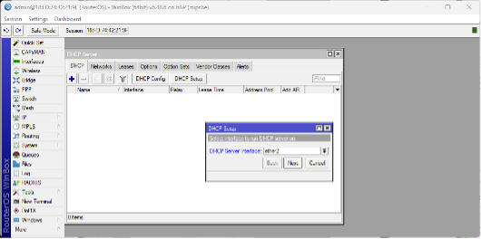

   - Apabila muncul **Interface is slave**, lihat penyelesaiannya di [sini](#InterfaceisSlave).

     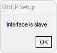

   - Jika masalah **Interface is slave** sudah selesai, klik tombol **DHCP Setup** lagi.
   - Pilih **DHCP Server Interface**: `ether2`. Klik **Next**

     

   - Muncul **DHCP Address Space**, yaitu NID (Network ID). Langsung klik **Next**.

     

   - Muncul **Gateway for DHCP Network**, yaitu IP pintu gerbang (alias IP interface `ether2` di mikrotik). Langsung klik **Next**.

     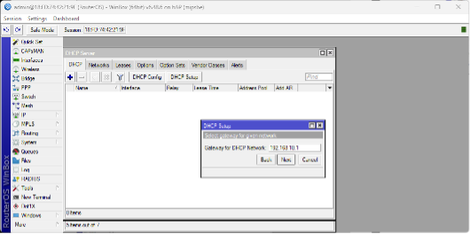

   - Muncul **Address to Give Out**, yaitu alamat IP yang ingin diberikan ke client yang terhubung ke MikroTik. Jika ingin mengubah range IP DHCP, maka bisa mengedit langsung, `misalnya: 192.168.10.10-192.168.10.20`. Jika tidak, bisa langsung klik **Next**.

     

   - Muncul **DNS Server**, yaitu DNS Server mobile hotspot. Langsung klik **Next**.

     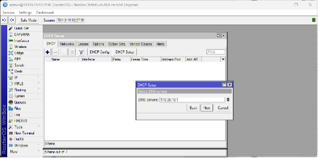

   - Muncul **Lease Tie**, yaitu waktu pelepasan IP. Jika ingin masa hidup IP yang lebih panjang, maka ubah menjadi `1d 00:00:00`, sehingga umur dari IP yang diberikan adalah 1 hari. Jika tidak, bisa langsung klik **Next**.

     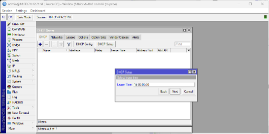

   - DHCP Server berhasil ditambahkan.

     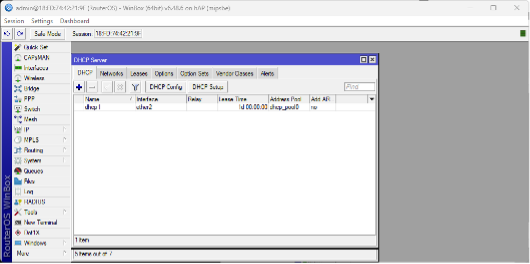

4. Setting DNS.

   - Buka menu **IP** dan pilih sub-menu **DNS**.
   - Ketik di **Servers**: 192.168.10.1 (sama seperti IP address `ether2`).

     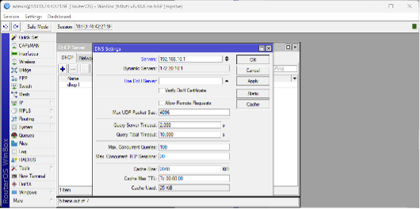

   - Klik **Apply** dan **OK**.

### <a name='SettingKomputerClient'></a>3. Setting Komputer Client

1. Buka **Advanced Network Settings**.
2. Pilih **Change adapter options**.

   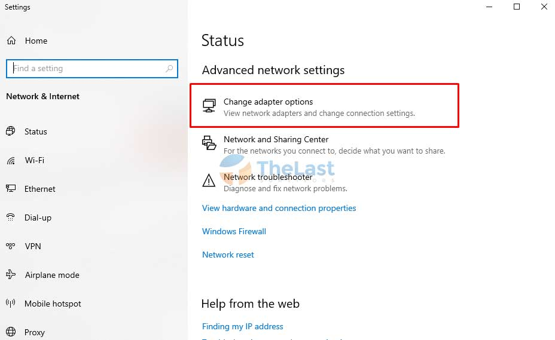

### <a name='Testing'></a>4. Testing

Tes apakah komputer Anda telah berhasil mendapatkan IP yang telah diberikan oleh DHCP Server di MikroTik.

1. Buka **Command Prompt**
2. Ketikkan `ipconfig`
3. Terlihat bahwa IP pada **Ethernet adapter ipv4** adalah `192.168.10.254`, yang artinya DHCP Server telah bekerja dengan baik.

   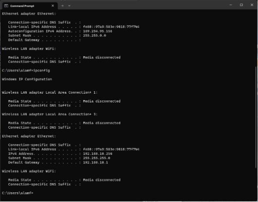

4. Tes koneksi internet pada komputer client, dengan mengetikkan `ping google.com`.

   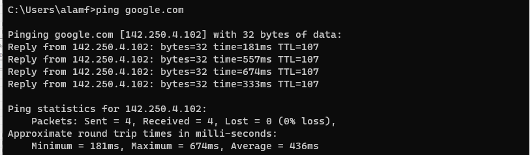

5. Buatlah backup terhadap setting MikroTik yang telah dilakukan.

   - Buka menu **Files**.

     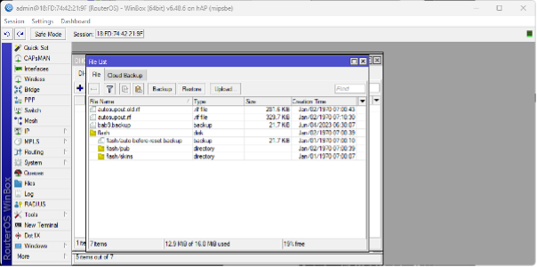

   - Klik tab **File**
   - Klik tombol **Backup**.
   - Ganti nama file sesuai dengan kebutuhan, misalnya `bab9.backup`.
   - Klik file backup, kemudian **Download**.

## <a name='Masalah'></a>Masalah

### <a name='WLANmanagedbyCAPsMAN'></a>1. Pada WLAN, tertulis **managed by CAPsMAN**.


Penyelesaian:

- Klik tombol **CAP**
- Hilangkan centang pada **Enabled**, untuk men-disable CAPsMAN

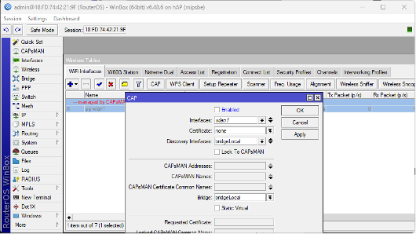

### <a name='InterfaceisSlave'></a>2. Interface is slave


Penyelesaian:

- Buka menu **Interfaces**, klik tab **Interface**
- Klik `bridge`, kemudian pilih tombol **silang** atau **minus**.
- Jika koneksi dengan MikroTik menutup tiba-tiba, lanjutkan penyelesaiannya di [sini](#HardReset)

### <a name='HardReset'></a>3. Hard Reset MikroTik

- Ambil benda tipis dan tajam, misalnya jarum pentul atau bolpoin.
- Cabut kabel power pada MikroTik.
- Tusukkan benda tersebut ke lubang kecil di MikroTik selama kurang lebih 5 detik.
- Masil sambil menusuk, pasang kabel power pada MikroTik. Tunggu kurang lebih 10 detik.
- Tunggu hingga lampu indikator di sebelahnya berkelap kelip.
