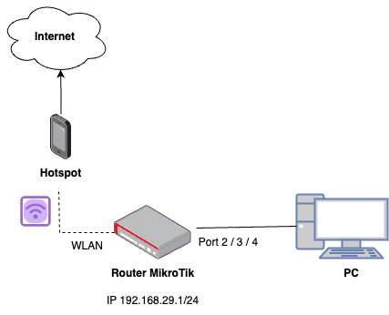

# EAS Jaringan Komputer

## Tools

1. Router MikroTik RB951Ui-2nd
2. Kabel UTP
3. WinBox
4. Cisco Packet Tracer

## 1. Setting DHCP Server

<p align="center">
  
</p>

Buatlah setting DHCP Server dengan langkah-langkah sebagai berikut:

1. Setting WLAN pada MikroTik dengan menggunakan mobile hotspot masing-masing. Jangan lupa setting password hotspot pada **security profiles**.
2. Setting DHCP Client supaya router MikroTik mendapatkan IP dari mobile hotspot untuk terhubung ke internet.
3. Pastikan MikroTik bisa terhubung ke internet dengan melakukan `ping google.com`.
4. Setting IP Address 192.168.29.1/24
5. Setting DHCP Server, Firewall NAT, dan DNS pada router MikroTik.
6. Setting PC Client supaya bisa mendapatkan IP dinamis.
7. Pastikan PC Client **berhasil mendapatkan IP dari DHCP Server** dan dapat **terhubung ke internet**.
8. Buatlah **file backup** dari setting MikroTik yang telah dilakukan. Beri nama `<kelompok>_<soal nomor>`.
   ```
   Contoh : kelompok1_soal1
   ```
   Upload ke https://drive.google.com/drive/folders/1tuYhAW78UChAejBg42CbCmOxxH3hOAdC?usp=sharing.

## 2. Setting Jaringan Hotspot

Buatlah setting jaringan Hotspot dengan ketentuan sebagai berikut:

1. Buat user profile sebanyak 3 (dosen, mahasiswa, tamu) dengan perbedaan kecepatan bandwidth dosen = full, mahasiswa = 512k/512k, tamu = 256k/256k.
2. Buat user 1 dosen, 1 mahasiswa, dan 1 tamu dengan username dan password bebas.
3. Buatlah fitur bypass untuk website [PIKTI ITS](https://pikti.itsteknosains.co.id/).
4. Buatlah fitur blokir situs untuk website [Kompas](www.kompas.com).
5. Buatlah **file backup** dari setting MikroTik yang telah dilakukan. Beri nama `<kelompok>_<soal nomor>`.
   ```
   Contoh : kelompok1_soal2
   ```
   Upload ke https://drive.google.com/drive/folders/18oB7jbvxOI2MPYxFiVEX4eSQppn4EhTc?usp=sharing.

## 3. Setting Routing Static dan Dynamic

**Tugas Individu**

Pengumpulan maksimal hari **Senin, 26 Juni 2023 pukul 23.59 WIB**.

1. Lakukan setting routing static menggunakan Cisco Packet Tracer dengan topologi jaringan dibawah ini.

   

2. Lakukan setting routing dynamic menggunakan Cisco Packet Tracer dengan topologi jaringan dibawah ini.

   

Upload ke https://drive.google.com/drive/folders/1u3IJfp-arshEP5oVxN8bKaRpZDUJ_RF9?usp=sharing
